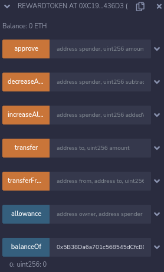
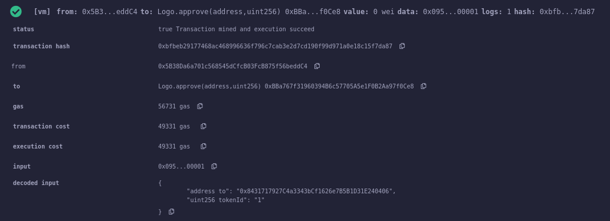
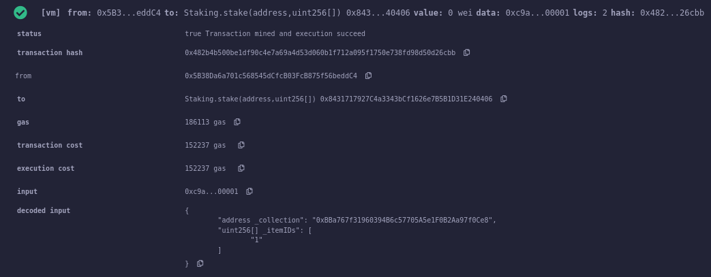
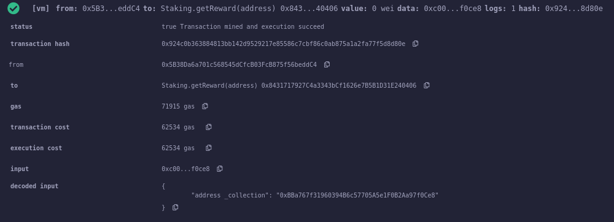
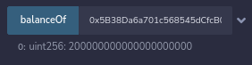

# Staking

## Description

The contract allows to stake NFT collection or separate NFT items.

The reward is paid in Reward Tokens.
For more details, refer to smart contract code(see comments).

## Proof that it Works

I have used created at Lab5 NFT collection - LOGO.

1. The initial balance in Reward Tokens

    

2. Mint and approve NFT transferring for Staking contract.

    

3. Stake NFT token

    

4. Get reward after 2 minutes of waiting

    

5. Check our new balance

    
