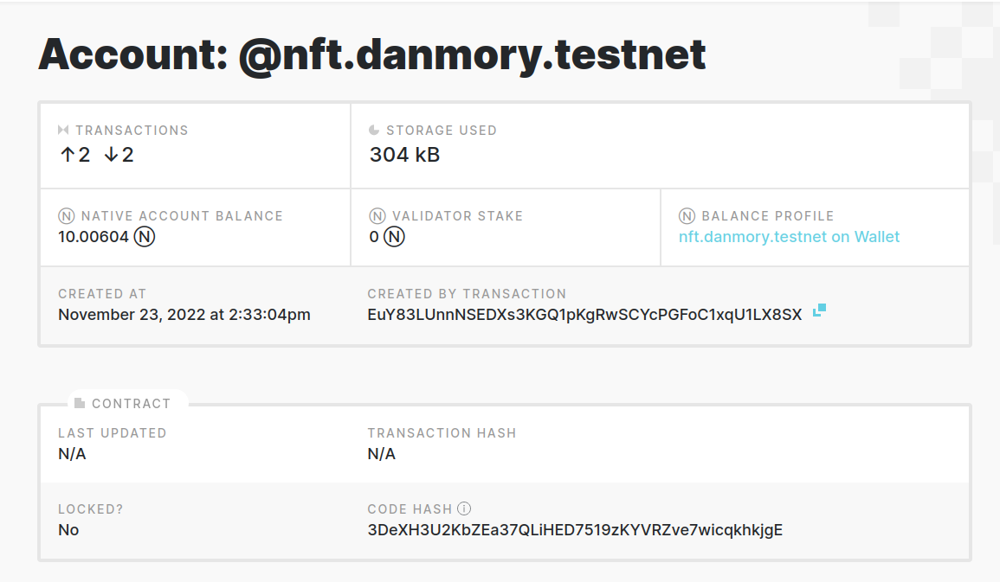
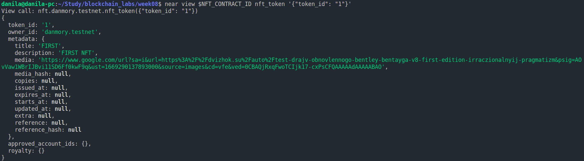
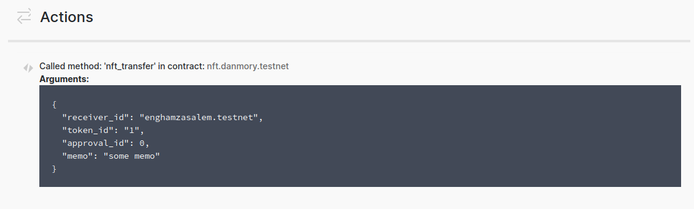
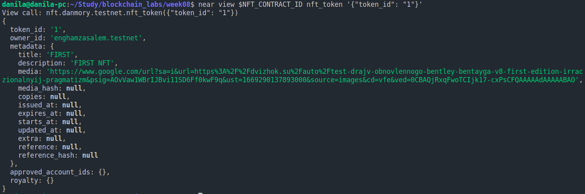
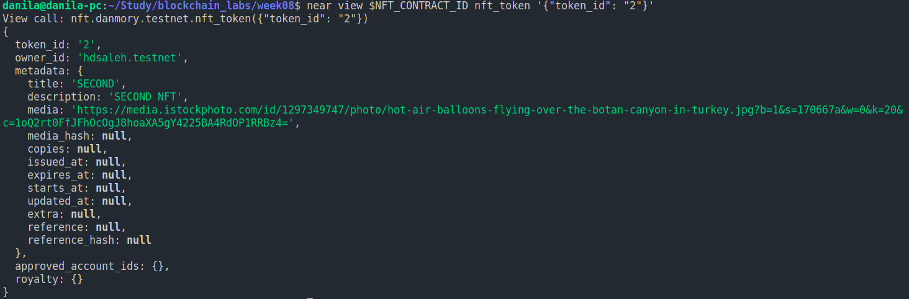

# NEAR NFT

Contract HASH Link: <https://explorer.testnet.near.org/transactions/7NZphK7sxfB9LhupqbHts7wxWZzAfW77z1wofkej6Lnh>

1. I have created NFT contract nft.danmory.testnet:

    

2. I have created NFT token with id 1:

    

3. I have sent NFT token to another account:

    

4. Check NFT token new owner:

    

5. And also the second NFT token:

    
