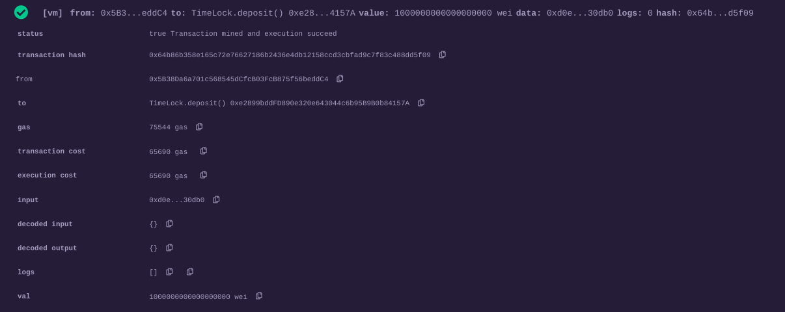
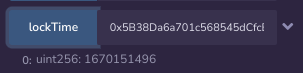
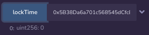
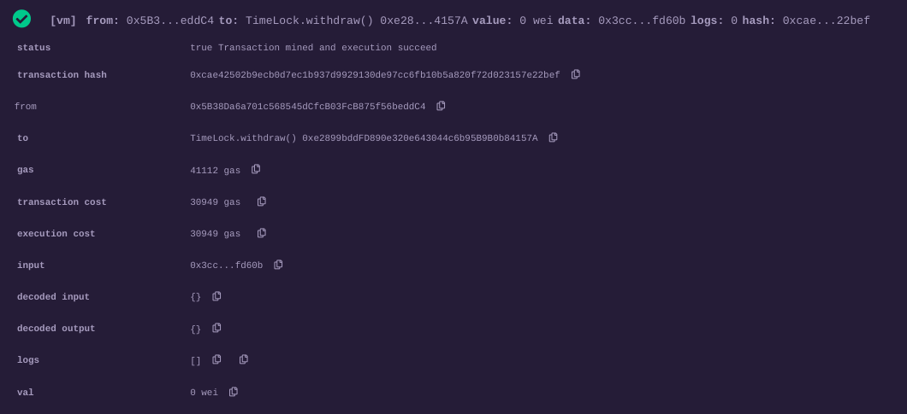
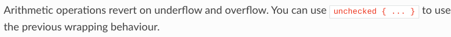
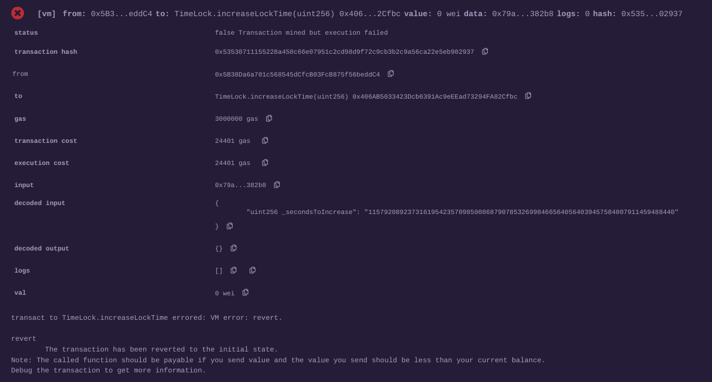

# Lets Attack

## Contract

```solidity
pragma solidity ^0.4.24;

contract TimeLock {
    mapping(address => uint256) public balances;
    mapping(address => uint256) public lockTime;

    function deposit() public payable {
        balances[msg.sender] += msg.value;
        lockTime[msg.sender] = now + 1 weeks;
    }

    function increaseLockTime(uint256 _secondsToIncrease) public {
        lockTime[msg.sender] += _secondsToIncrease;
    }

    function withdraw() public {
        require(balances[msg.sender] > 0);
        require(now > lockTime[msg.sender]);
        msg.sender.transfer(balances[msg.sender]);
        balances[msg.sender] = 0;
    }
}
```

## Attack

To withdraw the funds less than in a week we need to overflow lockTime
using function increaseLockTime.

Firstly, let's deposit 1 ether.



Secondly, let's check current lockTime.



Thirdly, we need to overflow lockTime. Let's increase it(call increaseLockTime) by *2^256 - 1670151496 = 115792089237316195423570985008687907853269984665640564039457584007911459488440*.

Fourthly, let's check lockTime now.



Wow! It's overflowed and equals to 0. Now we can withdraw our funds.



So, we have successfully withdrawn our 1 ether back.

## Prevent Attack

There are two ways to prevent this attack.

Firstly, we can use SafeMath library to prevent overflow.

Secondly, we can upgrade compiler version to >0.8.0.
Starting from this version, overflow is reverted.



I will use the second strategy. We should perform some updates in contract:

1. Update pragma solidity version to ^0.8.0.
2. Use *block.timestamp* instead of *now*.
3. Make address payable to transfer ether.

The contract will look like this:

```solidity
pragma solidity ^0.8.0;

contract TimeLock {
    mapping(address => uint256) public balances;
    mapping(address => uint256) public lockTime;

    function deposit() public payable {
        balances[msg.sender] += msg.value;
        lockTime[msg.sender] = block.timestamp + 1 weeks;
    }

    function increaseLockTime(uint256 _secondsToIncrease) public {
        lockTime[msg.sender] += _secondsToIncrease;
    }

    function withdraw() public {
        require(balances[msg.sender] > 0);
        require(block.timestamp > lockTime[msg.sender]);
        payable(msg.sender).transfer(balances[msg.sender]);
        balances[msg.sender] = 0;
    }
}
```

Now, when we try to overflow lockTime, our transaction will be reverted.


